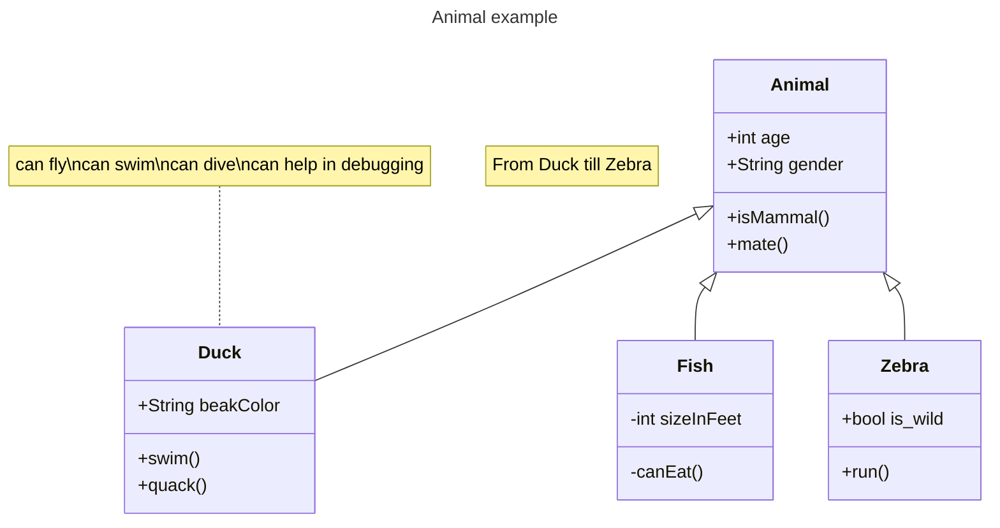

classDiagram
  App "1" *-- "1..* BuildePizza : association
  class App{
    +main()
  }
  class BuilderPizza{
    +build()
  }
  BuilderPizza "1" *-- "1" Pizzas : associtaion
  class Pizzas {+Pizzas()}   
