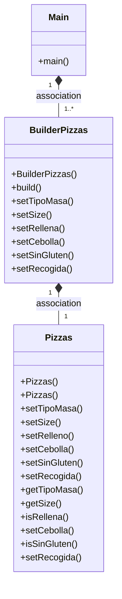
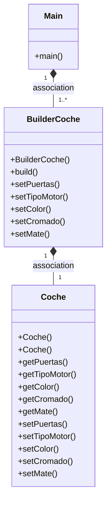
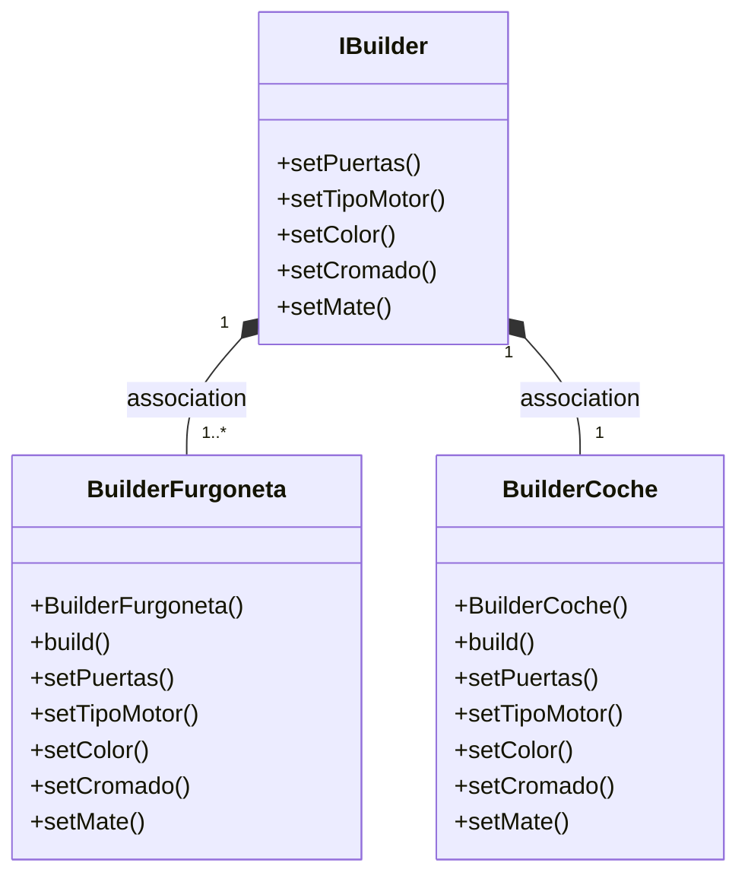

# ¿Cual es la función del patrón builder? Pon ejemplo (que no sea Pizzas)

El builder es un patrón de diseño que permite crear objetos complejos con sus variables por defecto cambiando las variables deseadas a la hora de inicializarlo.

Podríamos usar por ejemplo automobiles.

¿Es de 3 o 5 puertas?
¿Cuál es su color?
¿Diesel, Gasolina, Híbrido, Eléctrico?
Etc, etc...

# ¿Como es su Diagrama de clases de este ejemplo que has hecho? Realiza en el readme el diagrama



# ¿Podríamos combinarlo con el patrón Factory? Explícalo con algo de código como lo harías?

Podríamos hacer que el Builder sea una interfaz de la que se hereden los métodos para modificar los parámetros.
```
// InterfazBuilder
public interface IBuilder {
    void setPuertas(int num_puertas);
    void setTipoMotor(TipoMotor motor);
    void setColor(Color color);
    void setCromado(boolean cromado);
    void setMate(boolean mate);
}
```
Luego podría ser implementado por otras clases Builder.
```
public class BuilderCoche implements IBuilder {
    
    
    protected Automovil _coche;
    
    
    public BuilderCoche(){
        _coche = new Automovil();
    }    
    
    public Automovil build(){
        return this._coche;
    }
    
    public void setPuertas(int num_puertas){
        _coche.num_puertas = num_puertas;
        return this;
    }
    public void setTipoMotor(TipoMotor motor){
        _coche.motor = motor;
        return this;
    }
    public void setColor(Color color){
        _coche.color = color;
        return this;
    }
    public void setCromado(boolean cromado){
        _coche.cromado = cromado;
        return this;
    }
    public void setMate(boolean mate){
        _coche.mate = mate;
        return this;
    }
```    
Podemos hacer varios builders de esta manera.
    
```
public class BuilderFurgoneta implements IBuilder {
    
    protected Automovil _Furgoneta;
    
    
    public BuilderFurgoneta(){
        _Furgoneta = new Automovil();
    }
    
    public Automovil build(){
        return this._Furgoneta;
    }

    
    public void setPuertas(int num_puertas){
        _Furgoneta.num_puertas = num_puertas;
        return this;
    }
    public void setTipoMotor(TipoMotor motor){
        _Furgoneta.motor = motor;
        return this;
    }
    public void setColor(Color color){
        _Furgoneta.color = color;
        return this;
    }
    public void setCromado(boolean cromado){
        _Furgoneta.cromado = cromado;
        return this;
    }
    public void setMate(boolean mate){
        _Furgoneta.mate = mate;
        return this;
    }
    
    
}
```



